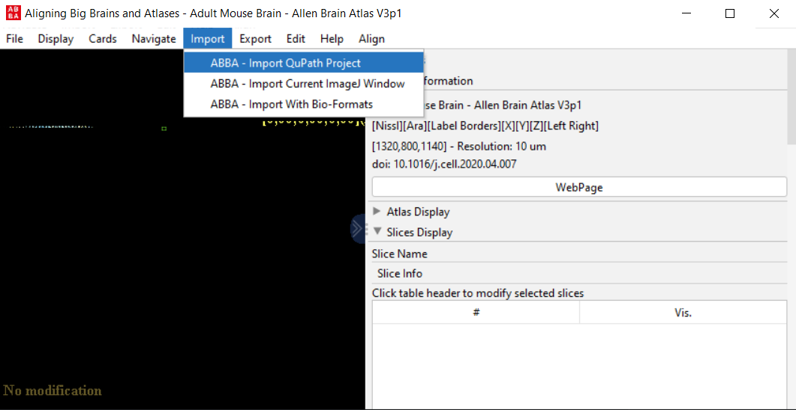
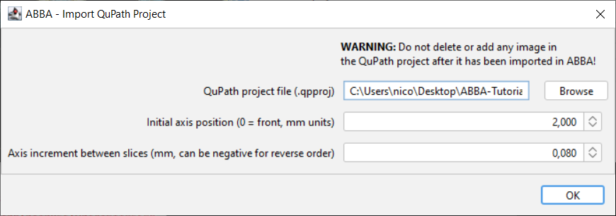
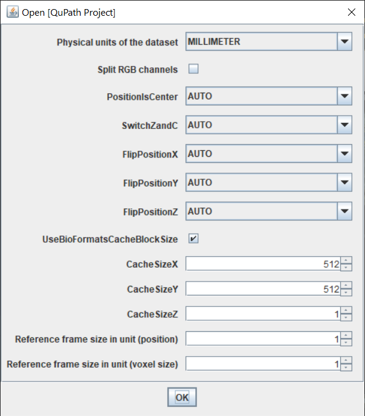

## Defining a dataset and importing it in ABBA

### Define a dataset of brain sections in QuPath 

As in the recommended workflow, you first need to create a qupath project that contains all the brain slices that you want to register - usually from one animal.

You can check the [full documentation of QuPath](https://qupath.readthedocs.io/en/latest/).

For a quick setup with the demo dataset:
* create a project by dragging and dropping an empty folder into QuPath
* drag and drop your images to import them into a QuPath project
* select `Bio-Formats builder` and then click Import

---

:warning: All files need to be properly calibrated (microns, millimeters, etc, but not pixels!). Check on the image tab of QuPath that you have a proper physical unit specified for your images, and not pixels!

---

You are done for now on the QuPath side. You can let QuPath open while performing Fiji's part of the workflow.

---

:warning: Do not modify the images present in the project once it has been opened and used in ABBA. ABBA has not been tested if the number of images present in the QuPath project are changed.

---

### Getting started with ABBA

Mac users : you will probably need a mouse.

In Fiji, start the ABBA plugin (type `ABBA` in Fiji's search bar or go to ` Plugins › BIOP › Atlas › ABBA`). You will then need to chose between 3 ways of slicing the atlas : coronal, sagittal, or horizontal. The documentation is made in the coronal sectioning orientation because it is probably the most frequent orientation, but ABBA works the same way in all orientations.

#### ABBA Navigation
ABBA uses [Fiji's BigDataViewer](https://imagej.github.io/plugins/bdv/index) in order to display multiresolution images in a responsive manner, this comes with a totally different way of visualizing your data than from the standard ImageJ. So let's first go through some basic navigation commands in ABBA:

* `hold and drag right-click` pan
* `mouse wheel`  zoom control
* `up / down key` zoom in / out
* `shift + up / down key` fast zoom in / out

Try to get familiar with these commands in order to go quickly from one end of the atlas to the other end.

#### Allen Brain Atlas display options

The image you see when you start ABBA is the Allen Brain Atlas dataset, sliced regularly along Z. This data consists of a 3 channel image:
* `Nissl (Channel 0)`
* `Auto Fluorescence (Channel 1)`
* `Label Borders (Channel 2)` 
  
You can activate or deactivate each of these channels with checkboxes and emphasize more or less their display with sliders.

### Import a QuPath project in ABBA

Once you are familiar with these controls, click, in the ABBA window menu bar: `Import > Import QuPath Project`

Select your project file, the initial position of the first slice, and the approximate spacing between slices in mm (the demo dataset has a spacing of 80 microns). These positions are just initial guesses which will be adjusted later on.

A second window shows up which specifies some advanced opening parameters. The default values (shown below) will work in most cases. By default, all units will be converted to millimeters, which is the default unit for ABBA.

It can take up to a minute for the first opening, due to bio-formats memoization.

### Slices selection and display options

Hold and drag the left mouse button allows to draw rectangles and select the slices you want to operate on. Each slice has a round handle which serve to indicate if it is selected (green) or not (yellow). Drawing rectangle with the modifier keys allow to add or remove slices to the current selection:
* `hold and left-click` draw a rectangle to select slices
* `ctrl + hold and left-click` remove slices from the current selection
* `shift + hold and left-click` add slices to the current selection

---

:warning:  you need to hold the modifier keys BEFORE drawing the rectangle in order to take their effect into account. This is in contrast to a lot of other software and a limitation of the UI of BigDataViewer

---

`ctrl+a` allows to select all slices, `ctrl+shift+a` allows to deselect all slices.

