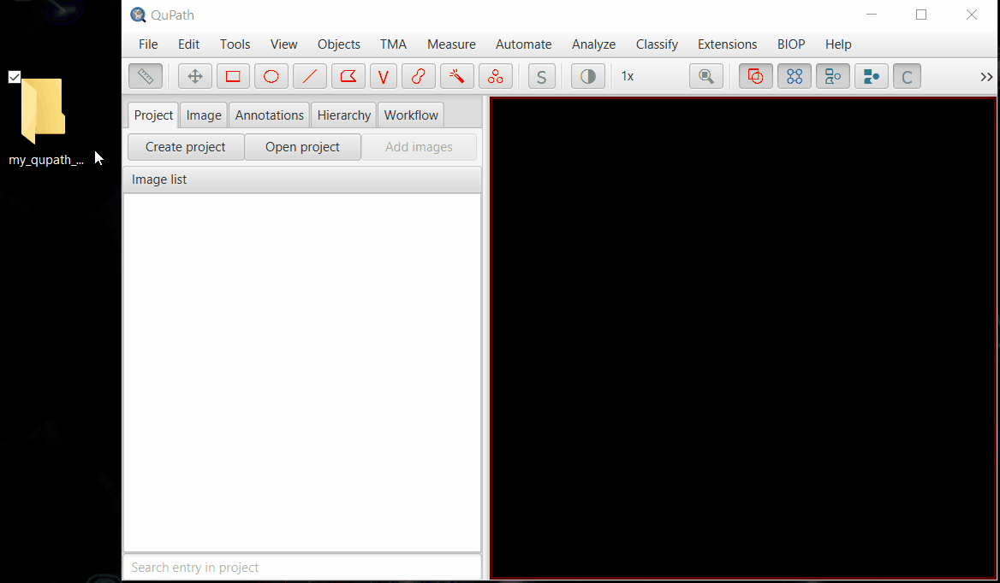

## Defining a QuPath project compatible with ABBA

-----
[**Back to documentation main page**](index.md)

-----

<!-- TOC -->
  * [Defining a QuPath project compatible with ABBA](#defining-a-qupath-project-compatible-with-abba)
* [Dataset pre-requisites](#dataset-pre-requisites)
    * [Define a dataset of brain sections in QuPath](#define-a-dataset-of-brain-sections-in-qupath)
<!-- TOC -->

-----

:warning: Do not modify the images present in the project once it has been opened and used in ABBA. ABBA has not been tested if the number of images present in the QuPath project are changed.

# Dataset pre-requisites

ABBA is designed to work on a set of slices belonging to a single animal. If multiple animals need to be aligned, then each animal should be aligned independently. It's not a strict restriction and you can combine images coming from different animals in a single dataset. However, you won't have full flexibility for the registration. Namely, you will not be able to set different cutting angles for different animals.

Now, let's discuss a bit what sort of images can be used. ABBA can:
- read all [Bio-Formats](https://bio-formats.readthedocs.io/en/latest/supported-formats.html) supported formats
- stream data from [OMERO](https://www.openmicroscopy.org/omero/)
- work on a [BigDataViewer dataset](https://www.openmicroscopy.org/omero/)
- read a [QuPath](https://qupath.github.io/) project (which internally uses Bio-Formats and OMERO)

**Working with a QuPath project is the preferred way to work with ABBA, because it facilitates a lot downstream processing.**

### Define a dataset of brain sections in QuPath 

As in the recommended workflow, you first need to create a QuPath project that contains all the brain slices that you want to register - usually from one animal.

You can check the [full documentation of QuPath](https://qupath.readthedocs.io/en/latest/).

For a quick setup with the [demo dataset](https://zenodo.org/records/6553641):
* create a project by dragging and dropping an empty folder into QuPath
* drag and drop your images to import them into a QuPath project
* select `Bio-Formats builder` and then click Import

Note: you can also work with OMERO images, as long as they are loaded through the [OMERO-RAW QuPath extension](https://github.com/BIOP/qupath-extension-biop-omero).

---

:warning: All files need to be properly calibrated (microns, millimeters, etc, but not pixels!). Check on the `Image` tab of QuPath that you have a proper physical unit specified for your images, and not pixels! If that's not the case, you should specify the correct pixel size NOW! (= BEFORE importing the project into Fiji's ABBA plugin). Otherwise, the images will look gigantic because 1 pixel is assumed to be 1 millimeter...

Also please make sure to read the message about [pyramidal file formats requirements](dataset_prerequisite.md#2-ideally-multi-resolution--bio-formats-supported--).

---

You are done for now on the QuPath side. You can let QuPath open while performing the rest of the workflow.

---

---

-----
[**Back to documentation main page**](index.md)

-----
