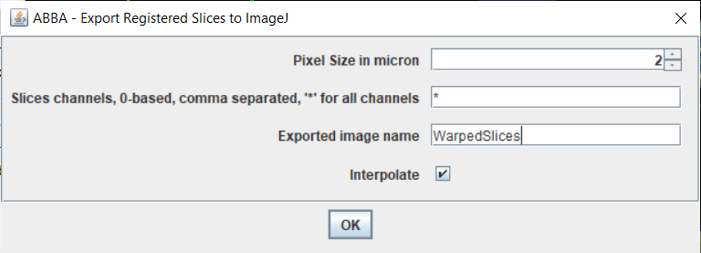
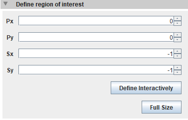
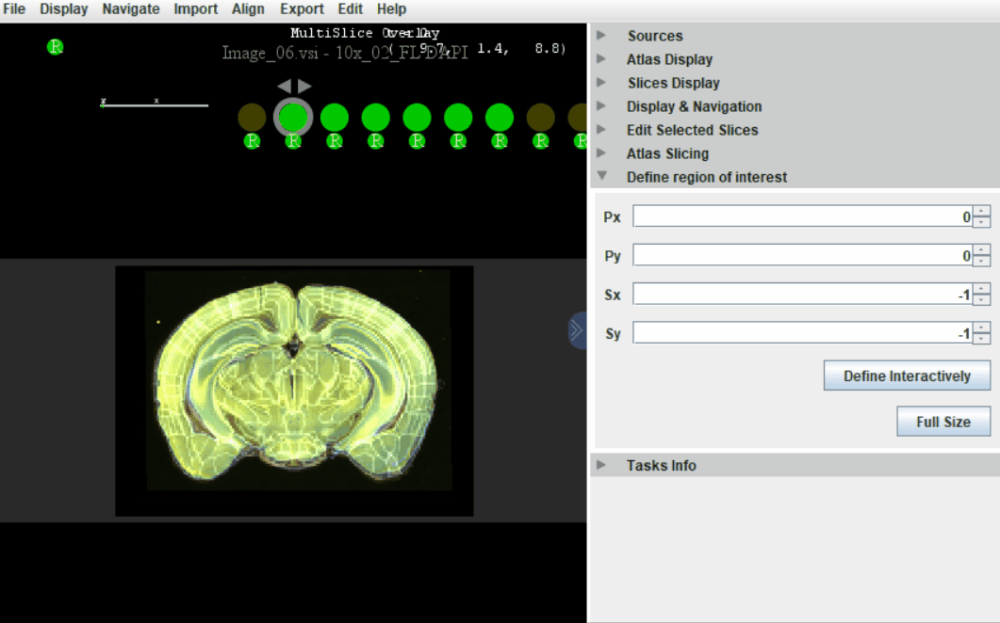
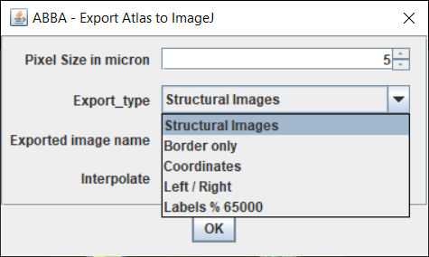
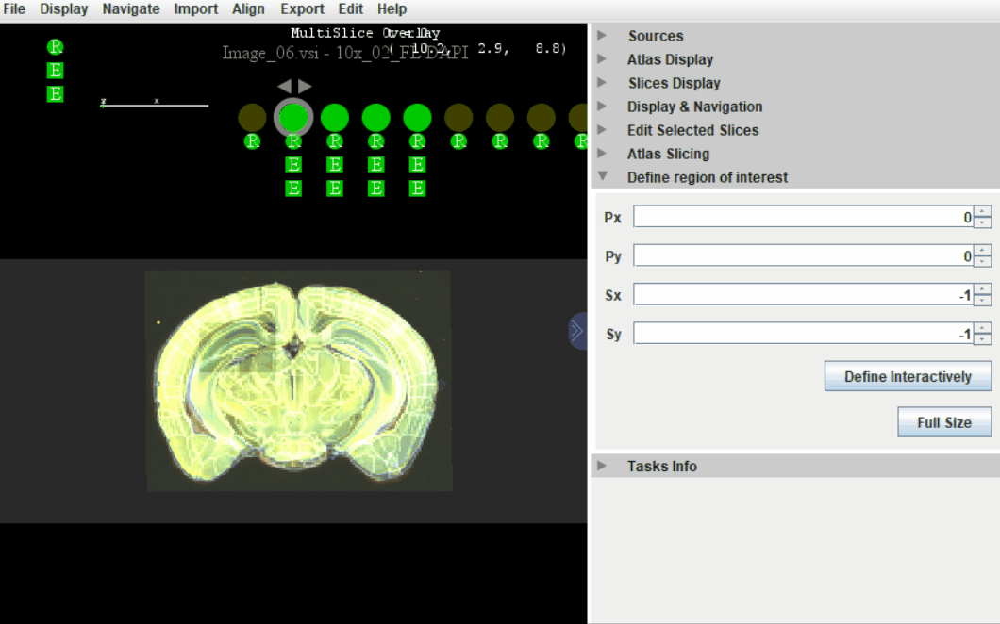

# Exporting ABBA's registration results

Probably the most useful way to use ABBA's result is to continue the analysis in QuPath (provided that you started on QuPath). In the QuPath workflow, the atlas regions are transformed into the original slice coordinates. For this procedure, please go to [analysis in qupath](qupath_analysis.md).

However, other export options are available within Fiji which are explained below.

## Principle

Briefly, in ABBA, the registration that is stored for each slice is a function that's capable to match a point located in the atlas to a pixel coordinates in a slice. (forward transform)

If the registration is not too weird, it is possible to inverse this function, and thus have a way to match a pixel of a slice to its corresponding atlas coordinates. (backward transform)

With this invertible transform in hand, the export possibilities are of many types:

1. it is possible to warp a slice onto the atlas
2. it is possible to warp the atlas onto a slice
3. it is possible to export an image of the atlas coordinates onto the slice
4. it is possible to warp an atlas region onto the slice

The point 4 corresponds to what happens in the QuPath workflow. Note that it is the fastest way to export the results (you just need to deform the outline of each region) and, because your original data is not deformed, it is also the best way to perform subsequent analysis.

The other options are detailed below.

## 1. Warping slices onto the atlas

### Why it is not so obvious

During ABBA's workflow, you observe that as you add registration steps, slices become better and better registered to the atlas (the atlas itself is sliced, but not deformed). So we already have warped slices on the atlas, no? In fact, the warped slices that you see in BigDataViewer cannot be used directly for analysis: only the part that needs to be displayed is warped on the fly, and at the resolution needed for a screen display. This allows to interactively navigate registered slices, but won't allow for an easy analysis.

To export warped slices, you will need to perform a full computation of a warped image at a certain resolution - resolution that you have to choose. This process is also called rasterization.

If you choose a very small pixel size, be aware that the computation can take a long time. So try first an export with a big pixel size (40 microns for instance). Note that diminishing by 2 the pixel size will lead to a multiplication by 4 of the computation time.

### Export warped slices

In ABBA, select the slices you want to export, and click `Export> ABBA - Export registered slices to ImageJ`. 

You can select the channels you want to export be separating them with commas, or type `*` to export all channels. Usually, 20 microns per pixel gives a fast and broad overview. It is not advised to export gigantic images this way. Processing big images will be faster by working on untransformed images in QuPath.

Clicking `interpolate` will lead to a smoother image at the cost of computation speed.

When this process is done, you end up with an ImageJ image stack, which can be saved and handled as any other regular image in ImageJ.

---

:warning: If you choose a really too small pixel size, you may reach ImageJ's limitation of 2 Gpixels per plane.

---

You may want to export not the full slice but only a subregion of the atlas. The computation for a small region can thus be much faster. To do this, open the `Define region of interest` panel, click `Define interactively` and draw the rectangular region of interest with the mouse. 

---

:warning: This region is also used to restrict registrations areas. Most probably you will want to restore the full size before starting a registration.

---

You can now draw a rectangle in the region of your choice, either in review mode or in positioning mode. You can click `Full Size` to restore the initial field of interest.

Now the exported slices will be restricted to your user defined ROI, as shown in the gif below.

Also, do not forget to adjust B&C once the export is done!

If you want to export the atlas data in the same conditions (sampling and region), you can click `Edit> ABBA - Export Atlas to ImageJ`. 

* `Structural images`: nissl and autofluorescence channels
* `Border only`: border between atlas regions
* `Coordinates`: a three channel stack corresponding to the atlas coordinates
* `Left/Right`: a mask defining the left from the right hemi brain
* `Labels % 65000`: a label image of the 'leaves' regions of the atlas. In the case of the Allen Brain Atlas, all values are the original ids modulo 65 000, because ImageJ cannot handle int32 label images.

This exported stack can be combined with the exported slices in a multi-channel stack, if the pixel size is the same.

## 2. Warping atlas onto the slice

This feature is not implemented yet, but it is not complicated to add. Make sure that you do not prefer the other options mentioned below, but if not, please contact the authors or use the feedback form of ABBA (`Help> ABBA - Give your feedback`) to request this feature.

