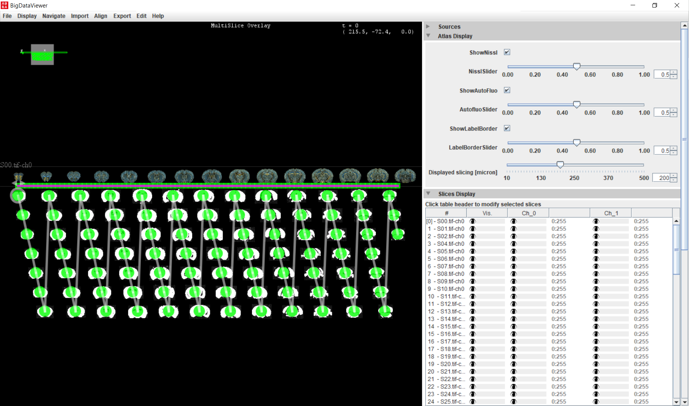

# Getting started with ABBA

-----
[**Back to registration workflow**](usage.md)

-----

Note : you will  need a mouse, since navigating with a trackpad can be very frustrating.

In Fiji, start the ABBA plugin (type `ABBA` in Fiji's search bar or go to ` Plugins › BIOP › Atlas › ABBA - ABBA Start`). You will then need to chose the atlas (the whole documentation is made with the Allen adult mouse brain atlas) and between 3 ways of slicing the atlas : coronal, sagittal, or horizontal. The documentation is made in the coronal sectioning orientation because it is probably the most frequent orientation, but ABBA works the same way in all orientations.

## ABBA Navigation
ABBA uses [Fiji's BigDataViewer](https://imagej.github.io/plugins/bdv/index) in order to display multiresolution images in a responsive manner, this comes with a totally different way of visualizing your data than from the standard ImageJ. So let's first go through some basic navigation commands in ABBA:

* `hold and drag right-click` pan
* `mouse wheel`  zoom control
* `up / down key` zoom in / out
* `shift + up / down key` fast zoom in / out

Try to get familiar with these commands in order to go quickly from one end of the atlas to the other end.

## Allen Brain Atlas display options

The image you see when you start ABBA is the Allen Brain Atlas dataset, sliced regularly along Z. This data consists of a 3 channel image:
* `Nissl (Ch. 0)`
* `Ara (Ch. 1)`
* `Label Borders (Ch. 2)`

You can activate or deactivate each of these channels with checkboxes and emphasize more or less their display with sliders.

## Import a QuPath project in ABBA

Once you are familiar with these controls, click, in the ABBA window menu bar: `Import > Import QuPath Project`

Select your project file, the initial position of the first slice, and the approximate spacing between slices in mm (the demo dataset has a spacing of 80 microns). These positions are just initial guesses which will be adjusted later on.

A second window shows up which specifies some advanced opening parameters. The default values (shown below) will work in most cases.

The plane origin convention do not matter.

----

:warning: if your dataset contains 16-bits RGB channels (as it is the case for some CZI files), you have to check the `Split RGB channels` checkbox.

----

It can take up to a minute for the first opening, due to bio-formats memoization.

With the downsampled demo dataset, you will get an image similar to this:

## Other imports

### Current ImageJ window
You can open in ABBA the current ImageJ window which is in focus. In you want this to work, make sure the pixel size is correctly set. If possible, specify the pixel size in millimeter.

:warning: There is currently a bug which makes impossible to re-open an ABBA state file that uses an ImagePlus ! 

### Direct opening of a file

As stated before, opening a file without being contained in a QuPath project may be annoying for downstream, but if you know what you're doing, then fine!

### Sources from BigDataViewer Playground

You can drag and drop sources from the [BigDataViewer Playground](https://imagej.net/plugins/bdv/playground/bdv-playground)'s [tree view](https://imagej.net/plugins/bdv/playground/bdv-playground-visualize) to the BigDataViewer window of ABBA.

-----
[**Back to registration workflow**](usage.md)

-----