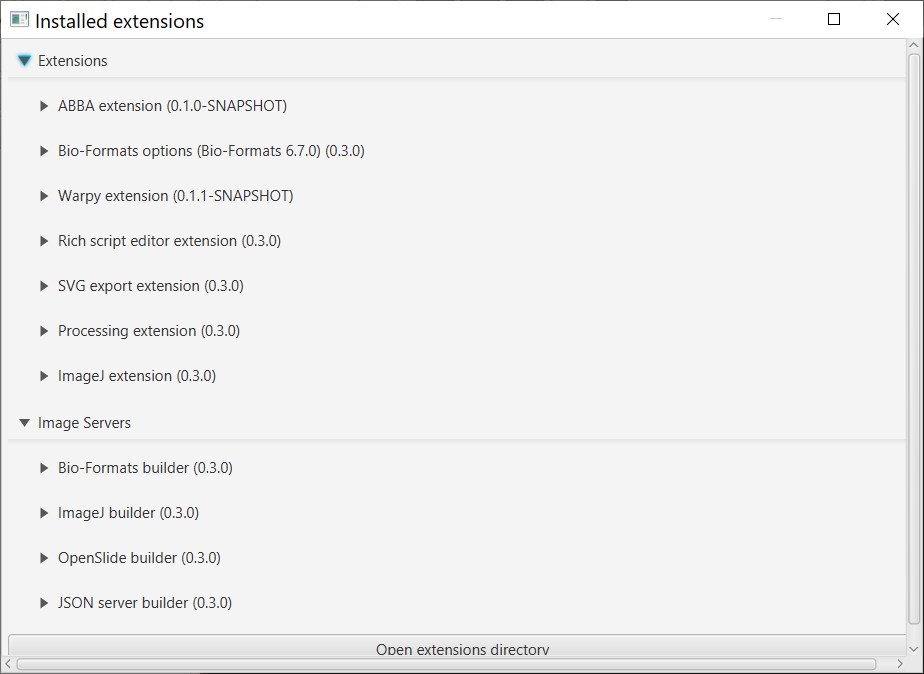
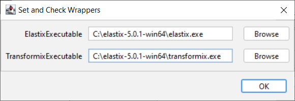
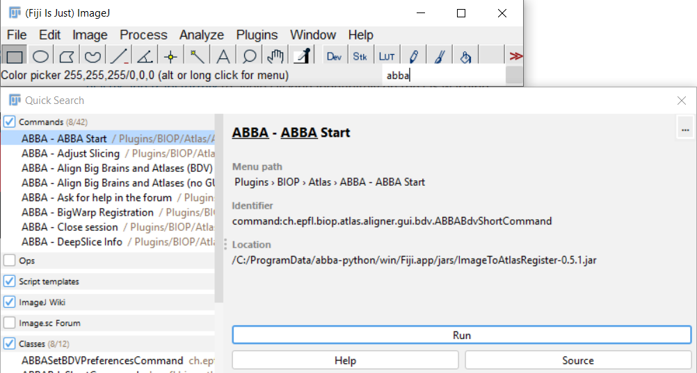
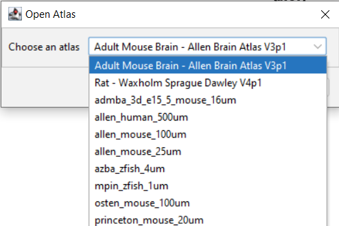
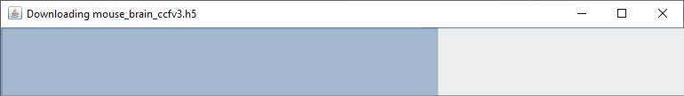

## Installation

---

:warning: ABBA should be used with QuPath v0.3+!

---

## Step by step standard installation
The installation consists of four steps detailed in the paragraphs below:

1. Install QuPath and 2 QuPath extensions,
2. Enable Fiji's ABBA update site,
3. Install the additional programs required for automated registration (Elastix / Transformix),
4. Setup ABBA in Fiji:
   * specify the location of elastix and transformix executable files to Fiji

### 1.  Install QuPath extensions

Install [QuPath version 0.3.0](https://github.com/qupath/qupath/releases/tag/v0.3.0).

Install the [QuPath Warpy extension](https://github.com/BIOP/qupath-extension-warpy) (and its dependencies):
* Go to the [latest release](https://github.com/BIOP/qupath-extension-warpy/releases)
  * Download `qupath-extension-warpy-x.y.z.zip` and unzip it
  * Drag its contained files into the main QuPath window

Install the [QuPath ABBA extension](https://github.com/BIOP/qupath-extension-abba) (and its dependencies):
* Go to the [latest release](https://github.com/BIOP/qupath-extension-abba/releases)
    * Download `qupath-extension-abba-x.y.z.jar`
    * Drag this jar file into the main QuPath window

* Restart QuPath: in `Extensions>Installed extensions` you should see both extensions installed:

### 2. Enable Fiji's ABBA update site
In Fiji:
* Click `Help > Update... > Manage update sites
* Tick the checkbox `ABBA (experimental)` 
* Click `Close`
* Click `Apply changes`
* Restart Fiji

### 3. Install of Elastix / Transformix

For automated registration, ABBA uses the [elastix](https://github.com/SuperElastix/elastix) software, which is independent of Fiji. The location of Elastix (and of its companion transformix) should be specified in Fiji in order for ABBA to use it. The best way is thus to install elastix and transformix on your local machine, as [explained below](installation.md#3a-local-installation-of-elastix).

If you do not manage to install elastix and transformix, don't give up yet! We provide a free public server [snappy.epfl.ch](https://snappy.epfl.ch/) which can perform automated registrations remotely. However, if your registration tests are successful, it is strongly advised to install elastix on your local computer.

#### 3a. Local installation of elastix

* Download the [latest release of elastix for your OS](https://github.com/SuperElastix/elastix/releases/tag/5.0.1). This documentation has been tested for elastix 5.0.1, a later version should also work.
* Unzip it somewhere convenient ( `C` drive on windows; `Applications` for Mac )

##### Windows

For windows users, you also need to install [Visual C++ redistributable](https://support.microsoft.com/en-us/topic/the-latest-supported-visual-c-downloads-2647da03-1eea-4433-9aff-95f26a218cc0), (choose `vc_redist.x64.exe` for a 64-bit system).

##### Mac

Fiji will be calling the elastix executables, which are recognized as ‘unknown developers’ by Mac OS. Thus you need to [make security exceptions for both elastix and transformix](https://support.apple.com/en-hk/guide/mac-help/mh40616/mac) to avoid clicking indefinitely on the OS warning messages.

##### Linux (not tested)
Nothing particular should be required for linux system.

##### Indicate `elastix` and `transformix` executable location in Fiji:

* In Fiji, execute `Plugins › BIOP › Set and Check Wrappers` then indicate the proper location of executable files, for instance:

  
This message should show up in the ImageJ console : 
* `[INFO] Transformix	->	set :-)`
* `Elastix	->	set :-)`

Once elastix is installed, you can run [the following script](https://gist.githubusercontent.com/NicoKiaru/b91f9f3f0069b765a49b5d4629a8b1c7/raw/571954a443d1e1f0597022f6c19f042aefbc0f5a/TestRegister.groovy) in Fiji to test elastix functionality. Save the linked file with a `.groovy` extension, open it Fiji, and run it.

---

:warning: Can't get elastix to work on your local computer ? Don't give up yet, you can try automated registration without a local elastix install. Go to the step 4 of the documentation.

---

#### 3b. Remote installation of Elastix

It's possible to install elastix on a server, that can then be used as a central server. For the moment a public freely accessible registration server is available at the address [`https://snappy.epfl.ch`](https://snappy.epfl.ch) and can be used for automated registration.

The procedure to install your own registration server will be detailed in the readme of the registration server github repo : [https://github.com/NicoKiaru/elastix_registration_server](https://github.com/NicoKiaru/elastix_registration_server) (TODO)

### 4. Setup ABBA in Fiji

Start Fiji, type `ABBA BDV` in the command search bar or navigate and click ` Plugins › BIOP › Atlas › ABBA - Align Big Brains and Atlases (BDV)`:

You will get the following window on startup:

These are the two atlases present by default. If this is the first time you launch ABBA, the atlas data will be downloaded and saved in your user folder inside a `cached_atlas` folder (3Gb. for the mouse brain atlas, 500 Mb for the rat atlas).

The allen brain atlas and associated files will be cached in your user folder under the directory `\cached_atlas`. These data are directly  downloaded from zenodo repositories:
- [Mouse atlas repository](https://zenodo.org/record/4173229#.YASj5RYo_BU)
- [Rat atlas repository](https://zenodo.org/record/5644162#.YZrUnroo8uU)

If the initial atlas download failed, because you had no access to internet or for any other reason, you can restart the command and let empty fields to trigger again the download from Zenodo.

