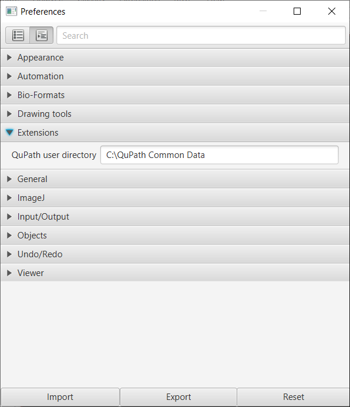
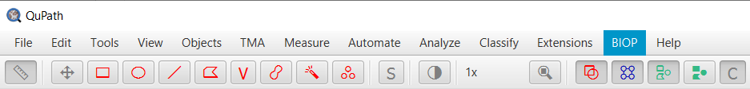

## Installation

The installation consists of four steps detailed in the paragraphs below:

1. Install QuPath and BIOP QuPath extensions (the use of QuPath is highly recommended),
2. Enable Fiji's ABBA update site,
3. Install the additional programs required for automated registration (Elastix / Transformix),
4. Setup ABBA in Fiji:
   * download Allen Mouse Brain Atlas
   * specify the location of elastix and transformix executable files to Fiji

### 1.  Install BIOP QuPath extensions

Install the [latest QuPath version](https://qupath.github.io/).

Install the QuPath biop extensions and its dependencies:
* Download [jars](https://drive.google.com/file/d/1NzNu4U0c_9zwcp-gV2x3HD5lg5MJib6z/view?usp=sharing) files 
* Extract the files and put its content them into a folder named `extensions` within another folder (for instance `C>QuPath Common Data>extensions`
* In QuPath, go to `Edit>Preferences`, specify the location of the `QuPath Common Data` folder:

* Restart QuPath: a BIOP menu should appear on top of the QuPath window:

### 2. Enable Fiji's ABBA update site
In Fiji:
* Click {nav Help > Update... > Manage update sites > Add update site }
* Click `Add update site`
* Then enter the following URL : `https://biop.epfl.ch/Fiji-ABBA/`,
* Click `Close`
* Click `Apply changes`
* Restart Fiji

### 3. Install of Elastix / Transformix

For automated registration, ABBA uses the [elastix](https://github.com/SuperElastix/elastix) software, which is independent of Fiji. Elastix (and its companion transformix) should be made available to ABBA for automated registration. The best way is thus to install elastix and transformix on your local machine, as explained in 2a.

If you do not manage to install elastix and transformix, don't give up yet! We provide a free public server [snappy.epfl.ch](https://snappy.epfl.ch/) which can perform automated registrations remotely. However, if your registration tests are successful, it is strongly advised to install elastix on your local computer in order to get stable performance for your registrations.

#### 3a. Local installation of elastix

* Download the [latest release of elastix for your OS](https://github.com/SuperElastix/elastix/releases/tag/5.0.1). This documentation has been tested for elastix 5.0.1.
* Unzip it somewhere convenient ( `C` drive on windows; `Applications` for Mac )

##### Windows

For windows users, you also need to install [Visual C++ redistributable](https://support.microsoft.com/en-us/topic/the-latest-supported-visual-c-downloads-2647da03-1eea-4433-9aff-95f26a218cc0), (`vc_redist.x64.exe` for a 64 bits system).

##### Mac

Fiji will be calling the elastix executables, which are recognized as ‘unknown developers’ by Mac OS. Thus you need to [make security exceptions for both elastix and transformix](https://support.apple.com/en-hk/guide/mac-help/mh40616/mac) to avoid clicking indefinitely on the OS warning messages.

##### Linux (not tested)
Nothing particular should be required for linux system.

##### Indicate `elastix` and `transformix` executable location in Fiji:

* In Fiji, execute `Plugins › BIOP › Set and Check Wrappers` then indicate the proper location of executable files, for instance:

  
This message should show up in the ImageJ console : 
* `[INFO] Transformix	->	set :-)`
* `Elastix	->	set :-)`

Once elastix is installed, you can run [the following script](https://gist.githubusercontent.com/NicoKiaru/b91f9f3f0069b765a49b5d4629a8b1c7/raw/571954a443d1e1f0597022f6c19f042aefbc0f5a/TestRegister.groovy) in Fiji to test elastix functionality. Save the linked file with a `.groovy` extension, open it Fiji, and run it.

---

:warning: If you can't get elastix working on your local computer ? Don't give up yet, you can try automated registration without a local elastix install. Go to the step 4 of the documentation.

---

#### 3b. Remote installation of Elastix

It's possible to install elastix on a server, that can then be used as a central server. For the moment a public freely accessible registration server is available at the address `https://snappy.epfl.ch` and can be used for automated registration.

The procedure to install your own registration server will be detailed in the readme of the registration server github repo : https://github.com/NicoKiaru/elastix_registration_server ( TODO)

### 4. Setup ABBA in Fiji ==

Execute Fiji, type `ABBA` in the command search bar or navigate and click `Plugins > BIOP > Atlas > ABBA`.

You will get the following window on startup:

You can let the first two fields empty. The Allen Brain dataset will then automatically be downloaded and monitored by a progress bar:

The allen brain atlas and associated files will be cached in your user folder under the directory `\cached_atlas`. These data are directly  downloaded from this Zenodo repository : https://zenodo.org/record/4173229#.YASj5RYo_BU . If you check `Store these settings for all users`, the data location for elastix and the atlas will be stored in a file `abbasettings.txt` stored in your hard drive in the folder {nav Fiji.app > plugins}. You can modify or delete this file if necessary. This is useful to avoid downloading multiple times the atlas in a multi user situation.
If the initial atlas download failed, because you had no access to internet or for any other reason, you can restart the command and let empty fields to trigger again the download from Zenodo.

The last two fields needs to be completed with the location of the executable file for elastix and transformix, if you manage to successfully install elastix and transformix on your computer. If you do not have a working local install, just let these fields empty.
* On windows:
  * `elastix.exe`
  * `transformix.exe`
* On mac and linux:
  * `elastix` or `elastix.sh`
  * `transformix` or `transformix.sh`

On following startups, you normally won't need to change anything in this window.