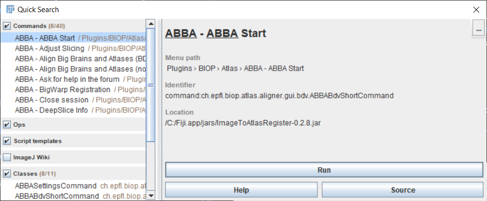

## Installation

-----
[**Back to documentation main page**](index.md)

-----

<!-- TOC -->
  * [Installation](#installation)
  * [Standalone installer](#standalone-installer)
  * [Automated installation](#automated-installation)
    * [For Windows](#for-windows)
    * [For Mac OSX](#for-mac-osx)
    * [For Linux](#for-linux)
  * [Step by step manual installation](#step-by-step-manual-installation)
    * [1.  Install QuPath extensions](#1-install-qupath-extensions)
    * [2. Install Fiji and enable Fiji's PTBIOP update site](#2-install-fiji-and-enable-fijis-ptbiop-update-site)
    * [3. Install of Elastix / Transformix](#3-install-of-elastix--transformix)
        * [Windows](#windows)
        * [Mac](#mac)
        * [Linux (not tested)](#linux--not-tested-)
        * [Indicate `elastix` and `transformix` executable location in Fiji:](#indicate-elastix-and-transformix-executable-location-in-fiji-)
    * [4. Setup ABBA in Fiji](#4-setup-abba-in-fiji)
<!-- TOC -->

---

:warning: ABBA should be used with QuPath v0.4+ (v0.3+ still possible)!

---

You can choose between several installation methods, depending on your OS.

Windows:
- automated bash scripts (Fiji) 

Mac OSX:
- automated bash scripts (Fiji)

All OS (Win, Mac, Linux):
- manual installation (Fiji)
- from [abba_python](https://github.com/BIOP/abba_python) github repository (Fiji + Brainglobe + DeepSlice + Python)

## Automated installation

Bash installation scripts for ABBA are available and have been tested for Windows 10, 11 and Mac OSX.
You will need a decent internet connection! Several gigabytes need to be downloaded (mainly Fiji, QuPath and the atlases).

### For Windows

* Install [Git for Windows](https://gitforwindows.org/) with standard options (just hit next on the installer)
* Download the [install scripts](https://github.com/BIOP/biop-bash-scripts/archive/refs/heads/main.zip) that comes from [this repository](https://github.com/BIOP/biop-bash-scripts)
* Unzip them
* Double click on the script `full_install_abba.sh`
* It is recommended to choose `C:/` as the install path
* Wait until the script ends

### For Mac OSX

You will need to know your admin password.

:warning: If, for some reason, you want to keep your previous version of QuPath intact, save it to a different name before starting the script.

* Download the [install scripts](https://github.com/BIOP/biop-bash-scripts/archive/refs/heads/main.zip)
* Unzip them
* Right-click on `full_install_abba.command` (do NOT double click!)
* Click Open
* Accept the execution: you will be asked for your admin password (you won’t see any character as you type the password, and that’s normal!)
* Enter `/Applications/` as the install path (compulsory)
* Wait until the script ends

If you get this issue:

```
shell-init: error retrieving current directory: getcwd: cannot access parent directories: Operation not permitted
/bin/bash: ./full_install_abba.sh: Operation not permitted,
```

Then follow the operation explained in [https://osxdaily.com/2018/10/09/fix-operation-not-permitted-terminal-error-macos/](https://osxdaily.com/2018/10/09/fix-operation-not-permitted-terminal-error-macos/) and restart the script.

### For Linux

UNTESTED!
* Run `full_install_abba.sh`

## Step by step manual installation
The installation consists of four steps detailed in the paragraphs below:

1. Install QuPath and its 2 required extensions,
2. Optional: install QuPath OMERO Raw extension for OMERO data stream support
2. Enable Fiji's PTBIOP update site,
3. Install the additional programs required for automated registration (Elastix / Transformix),
4. Setup ABBA in Fiji:
   * specify the location of elastix and transformix executable files to Fiji

### 1.  Install QuPath extensions

Install [QuPath version 0.4+](https://qupath.github.io/).

Install the [QuPath Warpy extension](https://github.com/BIOP/qupath-extension-warpy) (and its dependencies):
* Go to the [latest release](https://github.com/BIOP/qupath-extension-warpy/releases)
  * Download `qupath-extension-warpy-x.y.z.zip` and unzip it
  * Drag its contained files into the main QuPath window

Install the [QuPath ABBA extension](https://github.com/BIOP/qupath-extension-abba) (and its dependencies):
* Go to the [latest release](https://github.com/BIOP/qupath-extension-abba/releases)
    * Download `qupath-extension-abba-x.y.z.jar`
    * Drag this jar file into the main QuPath 

Optional: if you want to work on data coming from an OMERO database, install the [QuPath OMERO RAW extension](https://github.com/BIOP/qupath-extension-biop-omero) (and its dependencies):
* Read the [readme](https://github.com/BIOP/qupath-extension-biop-omero/blob/omero-raw/README.md) for installation instructions


Restart QuPath: in `Extensions>Installed extensions` you should see the following extensions installed:
  * ABBA
  * Image Combiner Warpy
  * Warpy
  * OMERO BIOP

### 2. Install Fiji and enable Fiji's PTBIOP update site

Download and install [ImageJ/Fiji](https://fiji.sc/)

In Fiji:
* Click `Help > Update... > Manage update sites
* Tick the checkbox `PTBIOP` 
* Click `Close`
* Click `Apply changes`
* Restart Fiji

### 3. Install of Elastix / Transformix

For automated registration, ABBA uses the [elastix](https://github.com/SuperElastix/elastix) software, which is independent of Fiji. The location of Elastix (and of its companion transformix) should be specified in Fiji in order for ABBA to use it. 

* Download the [latest release of elastix for your OS](https://github.com/SuperElastix/elastix/releases/tag/5.0.1). This documentation has been tested for elastix 5.0.1, a later version should also work.
* Unzip it somewhere convenient ( `C` drive on windows; `Applications` for Mac )

##### Windows

For windows users, you also need to install [Visual C++ redistributable](https://support.microsoft.com/en-us/topic/the-latest-supported-visual-c-downloads-2647da03-1eea-4433-9aff-95f26a218cc0), (choose `vc_redist.x64.exe` for a 64-bit system).

##### Mac

Fiji will be calling the elastix executables, which are recognized as ‘unknown developers’ by Mac OS. Thus you need to [make security exceptions for both elastix and transformix](https://support.apple.com/en-hk/guide/mac-help/mh40616/mac) to avoid clicking indefinitely on the OS warning messages.

##### Linux (not tested)
Nothing particular should be required for linux system.

##### Indicate `elastix` and `transformix` executable location in Fiji:

* In Fiji, execute `Plugins › BIOP › Set and Check Wrappers` then indicate the proper location of executable files, for instance:


  
This message should show up in the ImageJ console (and maybe errors for Cellpose, but that's not important): 
* `[INFO] Transformix	->	set :-)`
* `Elastix	->	set :-)`

Once elastix is installed, you can run [the following script](https://gist.githubusercontent.com/NicoKiaru/b91f9f3f0069b765a49b5d4629a8b1c7/raw/571954a443d1e1f0597022f6c19f042aefbc0f5a/TestRegister.groovy) in Fiji to test elastix functionality. Save the linked file with a `.groovy` extension, open it in Fiji, and run it.

### 4. Setup ABBA in Fiji

Start Fiji, type `ABBA Start` in the command search bar or navigate and click ` Plugins › BIOP › Atlas › ABBA - ABBA Start`:

You will get the following window on startup:


These are the two atlases present by default. If this is the first time you launch ABBA, the atlas data will be downloaded and saved in your user folder inside a `cached_atlas` folder (3Gb. for the mouse brain atlas, 500 Mb for the rat atlas).


The allen brain atlas and associated files will be cached:
* in your user folder under the directory `\cached_atlas` (Allen Brain CCFv3 and Waxholm Rat v4) (in `C:\ProgramData\abba-atlas` if you used the windows installer)
* in your user folder under the directory `\.brainglobe` for brainglobe atlases

For non-brainglobe atlases, data are downloaded from zenodo repositories:
- [Mouse atlas repository](https://zenodo.org/record/4486659#.YnfL81RBziE)
- [Rat atlas repository](https://zenodo.org/record/5644162#.YZrUnroo8uU)

If the initial atlas download failed, because you had no access to internet or for any other reason, you can restart the command to trigger again the download from Zenodo.

-----
[**Back to documentation main page**](index.md)

-----

