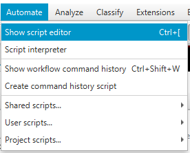
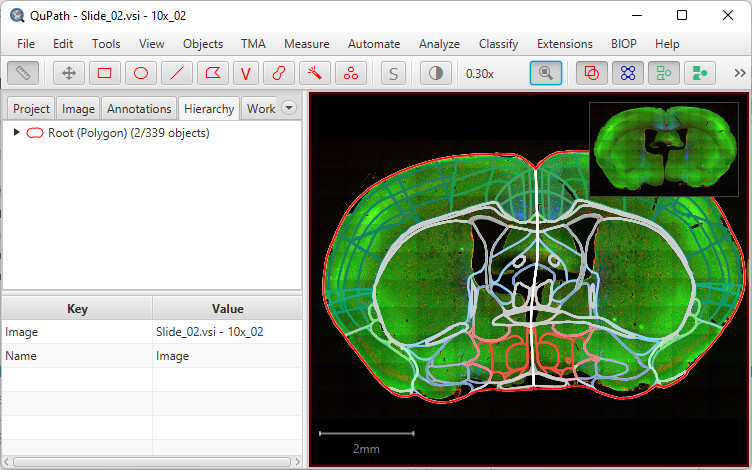
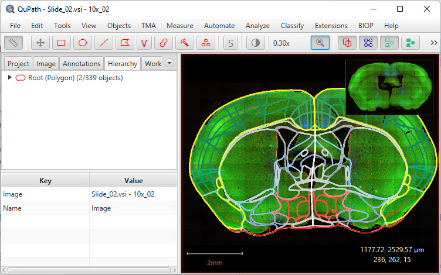
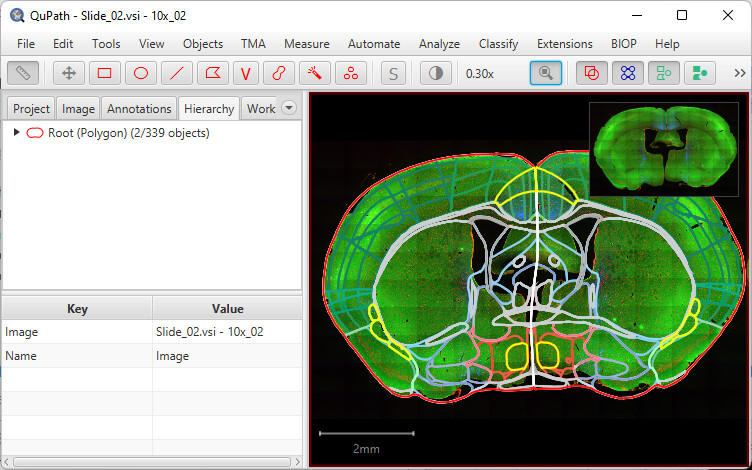
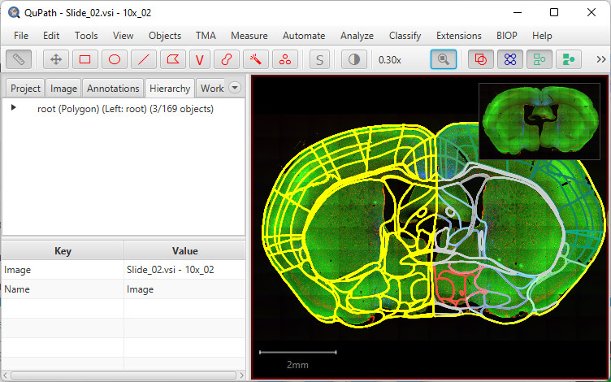
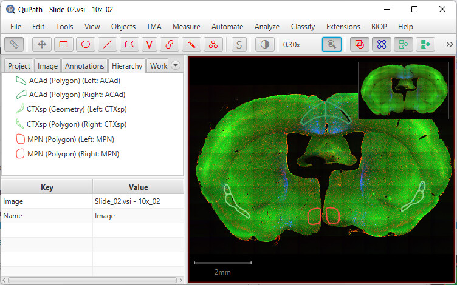

# Using ABBA's registration in QuPath

-----
[**Back to documentation main page**](index.md)

-----

<!-- TOC -->
* [Using ABBA's registration in QuPath](#using-abbas-registration-in-qupath)
  * [Exporting ABBA registration results](#exporting-abba-registration-results)
  * [Importing ABBA registration results in QuPath](#importing-abba-registration-results-in-qupath)
  * [Analysis in QuPath](#analysis-in-qupath)
  * [Compute the location of detections into the Atlas coordinates](#compute-the-location-of-detections-into-the-atlas-coordinates)
    * [Allen Brain CCFv3 coordinates](#allen-brain-ccfv3-coordinates)
  * [Repositories for data analysis](#repositories-for-data-analysis)
  * [Display results in 3D](#display-results-in-3d)
<!-- TOC -->

-----

## Exporting ABBA registration results
When a registration is done in ABBA, and if the slices have been opened from a QuPath project, it is possible to re-export the registration results into the original QuPath project.

For that, simply select all your slices of interest and click, in the top menu bar `Export > ABBA - Export Regions To QuPath project`.

When executing this action, ABBA exports, for each slice:
* regions of the allen brain atlas as a zip file (ImageJ rois file)
* a json file which can be used to compute the transformation between pixels coordinates of the original file to the Atlas (and vice versa)

These two files are saved into each QuPath entry folder. Additionally, the Atlas Ontology is written next to the QuPath project file (do not erase it!).

## Importing ABBA registration results: creating Atlas regions as QuPath annotations

In QuPath, provided you have correctly installed the [required extensions](installation.md), you can click `Extensions > ABBA > Load Atlas Annotations into Open Image`.


When opening the annotation, you will be able to split the regions between left and right hemi-brain, or not. You can press `N` to hide the name of the imported regions. The image will be less cluttered.

If you go to the workflow tab of QuPath, you will see that a workflow step is present and thus you can create a script out of it, such as:

```
setImageType('FLUORESCENCE');
clearAllObjects();
qupath.ext.biop.abba.AtlasTools.loadWarpedAtlasAnnotations(getCurrentImageData(), "acronym", false);
```

This script can be ran in batch to import the regions for all slices present in the QuPath project.


## Importing ABBA registration results: adding Atlas coordinates to QuPath detections measurements

A convenient way to pool analysis from several animals, is to combine the result of the analysis into a common coordinate space.

For that, we provide the following script which, for all detections of images in QuPath, appends the coordinate of each centroid detection as extra measurements:

```
/**
 * Computes the centroid coordinates of each detection within the atlas
 * then adds these coordinates onto the measurement list.
 * Measurements names: "Atlas_X", "Atlas_Y", "Atlas_Z"
 */

def pixelToAtlasTransform = 
    AtlasTools
    .getAtlasToPixelTransform(getCurrentImageData())
    .inverse() // pixel to atlas = inverse of atlas to pixel

getDetectionObjects().forEach(detection -> {
    RealPoint atlasCoordinates = new RealPoint(3);
    MeasurementList ml = detection.getMeasurementList();
    atlasCoordinates.setPosition([detection.getROI().getCentroidX(),detection.getROI().getCentroidY(),0] as double[]);
    pixelToAtlasTransform.apply(atlasCoordinates, atlasCoordinates);
    ml.putMeasurement("Atlas_X", atlasCoordinates.getDoublePosition(0) )
    ml.putMeasurement("Atlas_Y", atlasCoordinates.getDoublePosition(1) )
    ml.putMeasurement("Atlas_Z", atlasCoordinates.getDoublePosition(2) )
})

import qupath.ext.biop.warpy.Warpy
import net.imglib2.RealPoint
import qupath.lib.measurements.MeasurementList
import qupath.ext.biop.abba.AtlasTools

import static qupath.lib.gui.scripting.QPEx.* // For intellij editor autocompletion
```

This script can also be run in batch.

----
:bulb: It is not necessary to have imported the regions for this script to run. 

----


### Allen Brain CCFv3 coordinates

For the particular case of the Adult Mouse Allen Brain Atlas CCFv3, coordinates are oriented like this: [(source)](http://help.brain-map.org/download/attachments/5308472/3DOrientation.png?version=1&modificationDate=1368132564812&api=v2):


Mind the axes names and orientations!


## Analysis in QuPath

A typical workflow will consist of detecting cells in a particular region of the brain and exporting these results for all slices.

You can find the full QuPath documentation at https://qupath.readthedocs.io/en/0.4/, and get some support in https://forum.image.sc. But here are a few basic scripts to get you started:

### Basic QuPath scripts

To write a bit of code, click in QuPath: `Automate > Show script editor`.



#### 1. Clear all objects (cells, annotations)

```
// To clear all objects (take care, it also clear cells (detection objects)!)
clearAllObjects()
```

#### 2. Clear annotations only (Atlas regions)

```
// To clear all annotations objects:
removeObjects(getAnnotationObjects(), false) // last argument = keep child objects ?
```

#### 3. Import atlas regions (take care to not import it several times: clear the objects before)

```
// Load atlas and name all regions according with their acronym
// Last argument = split left and right regions
qupath.ext.biop.abba.AtlasTools.loadWarpedAtlasAnnotations(getCurrentImageData(), "acronym",true);
```

Here's the result:



#### 4. Collect and select a subregion (here the only with the acronym ‘CTXpl’)

```
// Gets all annotations (=regions) named CTXpl (left and right)
def myObjects = getAllObjects().findAll{it.getName() == 'CTXpl'} // replace 'CTXpl' by any region acronym existing in the atlas

// Then select them
selectObjects(myObjects)
```



#### 5. same as 4., but restricted to the left part of the brain

```
// Gets all annotations named CTXpl in the left region:
def myLeftObjects = getAnnotationObjects()
.findAll{it.getName() == 'CTXpl'} // replace 'CTXpl' by any region acronym existing in the atlas
.findAll{it.getPathClass().isDerivedFrom(getPathClass('Left'))} // select only the ones in the left regions
// Then select them      
selectObjects(myLeftObjects)
```


#### 6. to collect and select subregions from a list

```
// Gets all annotations which name is contained within a list:
listOfRegionsToSelect=['MPN', 'CTXsp', 'ACAd']


def myObjectsWithinAList = getAnnotationObjects()
.findAll{it.getName() in listOfRegionsToSelect}
//.findAll{it.getPathClass().isDerivedFrom(getPathClass('Left'))} // Uncomment this line to get only the objects in the left region

// Then select them             
selectObjects(myObjectsWithinAList)
```



#### 7. to collect all regions except the ones on a list

```
def myObjectsWithinAList = getAnnotationObjects()
.findAll{!(it.getPathClass() == null)} // removes null objects
.findAll{it.getPathClass().isDerivedFrom(getPathClass('Left'))}

// Gets all annotations except the ones of a list
def objectsOtherThan = getAnnotationObjects() - myObjectsWithinAList
selectObjects(objectsOtherThan)
```



#### 8. Removing objects

In the example below, we first selected the objects of interest, then use that to collect the other objects, that we remove with removeObjects

```
// Gets all annotations which name is contained within a list:
listOfRegionsToSelect=['MPN', 'CTXsp', 'ACAd']


def myObjectsWithinAList = getAnnotationObjects()
.findAll{it.getName() in listOfRegionsToSelect}

// Gets all annotations except the ones of a list
def objectsOtherThan = getAnnotationObjects() - myObjectsWithinAList


removeObjects(objectsOtherThan, true)
```



## Other repositories for data analysis

You can use the scripts developed by [@enassar](https://github.com/enassar) and [@nickdelgrosso](https://github.com/nickdelgrosso) in this repository: https://github.com/nickdelgrosso/ABBA-QuPath-utility-scripts in order to automate cell detection and export.

:warning: the repo has not been updated to the more recent ABBA version, so please use https://github.com/NicoKiaru/ABBA-QuPath-utility-scripts instead.

An alternative repository which allows to do additional processing is available in https://github.com/bmi-lsym/ABBA-QuPath-post_processing

Note that these set of scripts may not have been yet update to the most recent version of ABBA.

## Display results in 3D

Some analysis scripts are also available in https://github.com/nickdelgrosso/ABBA-QuPath-RegistrationAnalysis

To be done... combining [PaQuo](https://paquo.readthedocs.io/en/latest/quickstart.html) and [BrainRender](https://github.com/brainglobe/brainrender) looks like the best option for this task. 

-----
[**Back to documentation main page**](index.md)

-----
