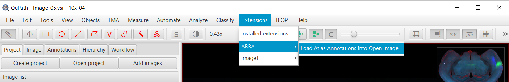

# Using ABBA's registration in QuPath

## Exporting ABBA registration results
When a registration is done in ABBA, and if the slices have been opened from a QuPath project, it is possible to re-export the registration results into the original QuPath project.

For that, simply select all your slices of interest and click, in the top menu bar `Export > ABBA - Export Regions To QuPath project`.

When executing this action, ABBA exports, for each slice:
* regions of the allen brain atlas as a zip file (ImageJ rois file)
* a json file which can be used to compute the transformation between pixels coordinates of the original file to the Allen Brain Atlas CCFv3 (and vice versa)

These two files are saved into each QuPath entry folder. Additionally, the Allen Brain Ontology is written next to the QuPath project file (do not erase it!).

## Importing ABBA registration results in QuPath

In QuPath, provided you have correctly installed the [required extensions](installation.md), you can click `Extensions > ABBA > Load Atlas Annotations into Open Image`.



When opening the annotation, you will be able to split the regions between left and right hemi-brain, or not.

The following script can also be used and ran in batch to import the regions for all slices of the dataset:

```
TO UPDATE
```

If you need to keep only certain regions, you can modify and reuse the script below:

```
TO UPDATE
```

## Analysis in QuPath

A typical workflow will consist of detecting cells in a particular region of the brain and exporting these results for all slices.

The following draft script can be used to restrict cell detection to a particular region of the brain, and if run in batch, to make this detection for all slices:

```
import static qupath.lib.gui.scripting.QPEx.* // For intellij editor autocompletion

def regionClassPath = "Right: SSp-ul" // for instance, provided regions have been splitted before import. 
// Check imported region to know what can be chosen as a String

selectObjectsByClassification(regionClassPath);

//TODO : cell detection, etc.

```

## Export result into common coordinates of the Allen Brain Atlas (CCFv3)

A convenient way to pool analysis from several animals, is to combine the result of the analysis into a common coordinate space.

For that, we provide the following script which, for all detections of images in QuPath, appends the coordinate of each centroid detection as extra measurements ("CCFx","CCFy", "CCFz"):

```
TO UPDATE
```

This script can also be run in batch.

## Analysis in QuPath

You can use the scripts developed by [@enassar](https://github.com/enassar) and [@nickdelgrosso](https://github.com/nickdelgrosso) in this repository: https://github.com/nickdelgrosso/ABBA-QuPath-utility-scripts in order to automate cell detection and export.

Some analysis scripts are also available in https://github.com/nickdelgrosso/ABBA-QuPath-RegistrationAnalysis 

## Display results in 3D

To be done... combining [PaQuo](https://paquo.readthedocs.io/en/latest/quickstart.html) and [BrainRender](https://github.com/brainglobe/brainrender) looks like the best option for this task. 

[**Back to step by step tutorial**](usage.md)
