# Registration of mouse brain slices with ABBA

Once your dataset is opened in ABBA. You will be able to position slices first along the slicing axis (position multiple slices along "z"), then to performing 2d adjustement for each slice (tilt and roll atlas slicing correction, 2d affine and spline in-plane registrations).

When you start ABBA, you will be in the `Positioning mode`, where the allen brain atlas is displayed with slices regularly spaced on top of the slices present on your dataset. 

----

:warning: trackpad
aficionado, the interface is much easier to use with a mouse

----

## Slices selection

The way ABBA works is by acting on selected slices and by performing actions on them. Each slice has a round handle which serve to indicate if it is selected (green) or not (yellow).

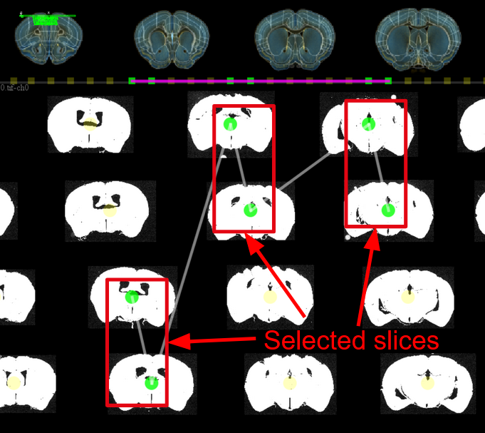

There are two ways of selecting slices:
1. by drawing rectangles with the left mouse button. Modifier keys allow to add (`shift`) or remove (`ctrl`) slices to the current selection:
  * `hold and left-click` draw a rectangle to select slices
  * `ctrl + hold and left-click` remove slices from the current selection
  * `shift + hold and left-click` add slices to the current selection

---

:warning:  you need to hold the modifier keys BEFORE drawing the rectangle in order to take their effect into account. This is in contrast to a lot of other software.

---

Gif below : adding slices to selection using `shift+rectangle`, removing from the selection with `ctrl+rectangle`, finally selecting all slices with `ctrl+a`.

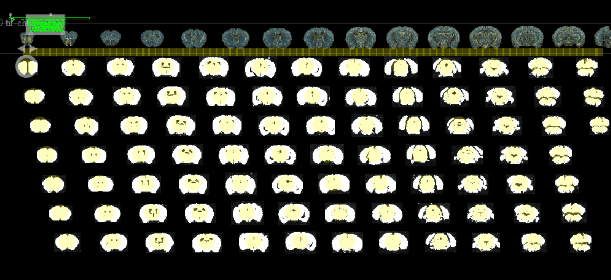

2. by selecting slices in the `Slices Display` card table:

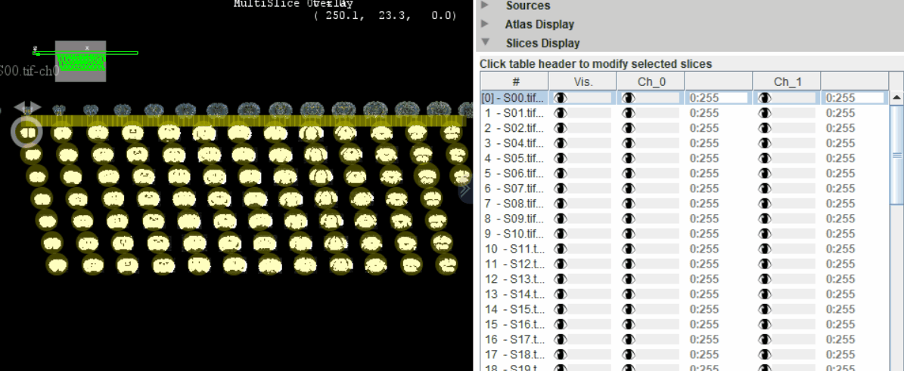

`ctrl+a` allows to select all slices, `ctrl+shift+a` allows to deselect all slices.

## Slices display options

It will be convenient for the registration to have your slices properly displayed. Depending on your use case, you may want to display a subset of the available channels, and adjust the min and max value displayed for a good contrast.

But first, in multi series files like vsi files it could happen that you end up with unwanted images (label or macro image). In this case, you will need to remove these slices. For vsi files, these unwanted images, because they are rgb images, appear black in the slice display table. It is thus easy to select them. The selected slices can then be removed form ABBA by right clicking in the viewer window of ABBA and selecting `Remove Selected Slices` (also accessible in the menu bar : `Edit > Remove Selected Slices`). 

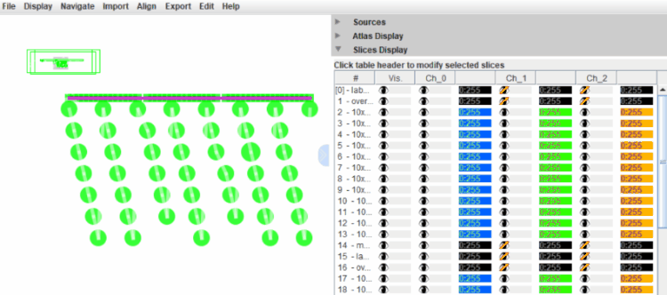

Usually, slices will have multiple channels, autodetected by bio-formats, but while some channels will be useful for analysis, some will be useful just for the sake of registration to the atlas. In order to display only certain channels, you can activate or deactivate the display of selected slices by clicking on the header of the slice display table:

You can set the color and the min and max display values of these slices:

If needed, the display of each slice can be customised by modifying the corresponding line in the table.

## Registration to Allen Brain Atlas (2017 CCF v3)

This procedure starts first by a manual step, which has two goals:

* Estimate the position of each slice along the atlas
* Adjust the atlas slicing angles

---

warning: If your slices are of sufficient quality, do not forget to check [**ABBA's DeepSlice integration**](registration_with_deepslice.md) in order to skip the initial manual registration steps.

---

In order to position each slice approximately along the slicing axis, ABBA tries to provide a convenient interface to manipulate series of slices.

### First coarse positioning

#### Rotate / flip slices

It could happen that the acquired slices were flipped or rotated compared to the atlas. The tab `Edit Selected Slices` provides 4 actions which can be used to correct this:

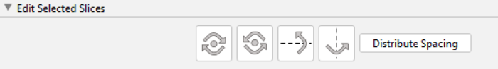

The first two buttons rotate selected slices by 90 degrees CW or CCW. The next two buttons flip slices vertically or horizontally.

In the top menu bar `Edit>ABBA - Rotate` can be used to rotate selected slices along any XYZ axis and with a custom angle in degree (you'll most probably need Z axis rotation).

Contrary to a lot of other actions in ABBA, these actions (flip rotate) are not undone with `ctrl+Z` (and redone with `ctrl+shift+z`). These actions can be easily reversed by applying an opposite rotation / flip.

#### Manual interactive transformation of slices (Scale, Translate, Rotate)

In the top menu bar `Edit>ABBA - Interactive Transform` can be used to apply a transformation on the selected slices. You can rotate, translate and scale anisotropically the slides (slices are often shrunk in Y by about 20 % because of the slicing).

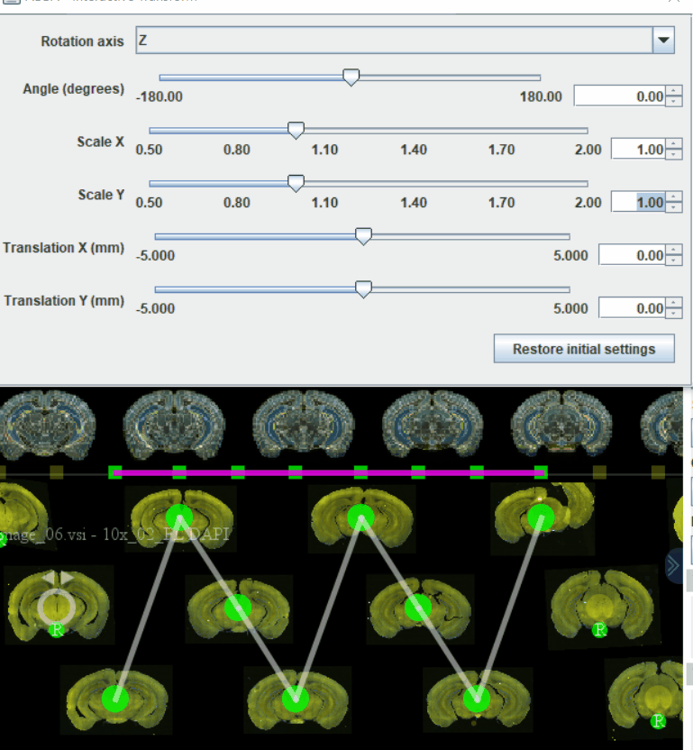

This can be convenient if you need a fast visual feedback to the transformations you are applying. Simply close the `Interactive transform` window when you are satisfied with the result. This also works in review mode or with a different overlap mode, if you want to be more precise.

Contrary to a lot of other actions in ABBA, this interactive command cannot be undone with `ctrl+Z` (and redone with `ctrl+shift+z`). However, you can restore the original transformation if you click the `Restore initial settings` button.

#### Correct location of slices along the axis

Before any registration can be started, you will need to position the slices along the Z axis, and also correct the atlas slicing angles to match those of your dataset. The atlas slicing angle will be the same for all  slices, which is the reason why it's convenient to register one animal at a time.

##### Drag selected slices
First of all, it may happen that your slices are not sorted correctly along the atlas axis. If this is the case, you can select slices which are not at their correct position and drag them along the axis. You can create some interval if necessary in between two slices in order to let others in between if needed.

You can select one or several slices and then, by dragging the rectangles located below the atlas, you can shift selected slices along the slicing axis:

##### Distribute spacing between selected slices

In order to apply the same spacing between each selected slices, you can either click the button `distribute spacing` in the card `Edit Selected Slices` or press the shortcut key `d`. This action, as many other, can be cancelled by pressing `ctrl+z` and redone by pressing `ctrl+shift+z`:  

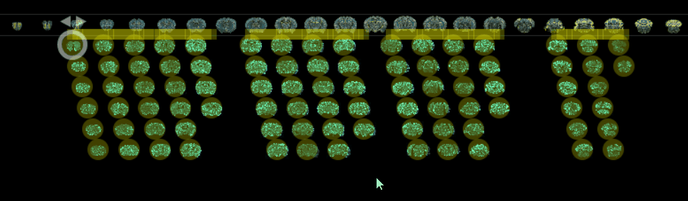

When no slice is a key slice ( see next section ), `distribute spacing` keeps constant the position of the first and last selected slices.

##### Lock the position of slices by setting "key slices"

By using ABBA interface, you will be able (and will need), using pan and zooms to switch between a zoomed-out overview and a zoomed-in view where you look precisely at how a particular slice matches the atlas.

Generally, to align the position of slices along the atlas, a convenient workflow is the following, you will need to follow these steps:

* as mentioned before, sort slices correctly along the axis
* rotate / flip slices to match the orientation of the atlas  
* display the atlas sliced with the largest slices thickness ( one slice every 500 microns ):
* approximately shift slices along the atlas
* match precisely a slice of your choice (usually one with easily recognizable features) with the atlas by zooming in
* set this slice as `key slice` (select this slice only, right click and select `Set as key slice` in the popup menu). As long as you don't drag this slice, each key slice has its z position locked in the atlas: `Distribute Spacing` won't affect the position of key slices.
* set a few others slices precisely and set them as key slices
* adjust the angles of the atlas slicing and check all slices
* for set a regular spacing between key slices, click `Distribute spacing` 

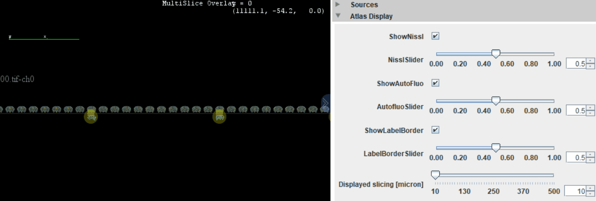

Automatically, the position of the slices within the dataset will be adjusted to the new atlas slicing. It's important to understand that the slicing spacing currently displayed does not affect the registration in any way. Internally, all slices all positioned with 10 microns precision, corresponding to the atlas highest resolution.

This coarse display allows, by dragging slices, to adjust approximately all slices along the atlas.

Then, you can zoom in, drag slices until you find a corresponding slice between your dataset and the atlas.

It's possible, once a matching atlas slice is found, to select the slice of interest and set it as a Key Slice (right-click menu), as shown below:

When key slices are selected, they will keep their position along the axis when other slices are dragged ( you can still directly drag the key slice if you need to move it) . The other slices are stretched along the axis while maintaining their spacing ratio. 

You can set multiple key slices in specific positions along your sections, usually the ones with the most recognizable features.

2 or 3 key slices is usually sufficient for a correct positioning along the atlas. The `distribute` button or action will equalize spacing between selected slices while respecting the position of selected key slices ( and the position of the first and last selected slices ).

##### Using the review mode to investigate the position of slices along the atlas

In the positioning mode used so far, it is easy to move slices around, but it is not convenient to overlay the sections to the atlas. 

It is possible to switch to a review mode by either:
* pressing the shortcut key 'r'
* clicking `Review`in the card `Display&Navigation > Modes`
* in the menu bar `Display > Review Mode`

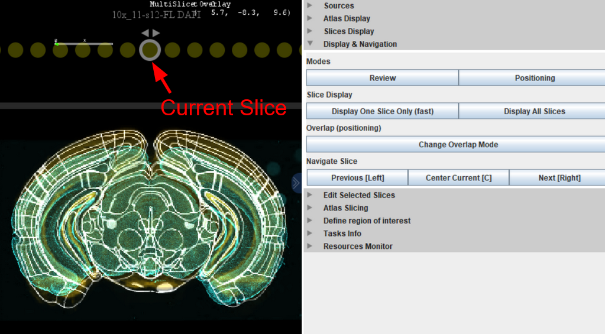

In this mode, a single slice is displayed at a time overlaying the atlas. The slice which is being displayed is the **current slice**. The current slice is indicated by a white circle around the slice handle.

You can navigate along the slices by pressing arrow keys or pushing `Previous` and `Next` in the `Display & Navigation` card.

If you notice a problem in the review mode, you can switch back any time to the `positioning mode` in order to correct the slice position or the atlas slicing angle.

--- 

`Right` and `Left` key to change the current slice also works in the positioning mode. Brackets `[]` indicates the current slice in the `Slices Display` card table:

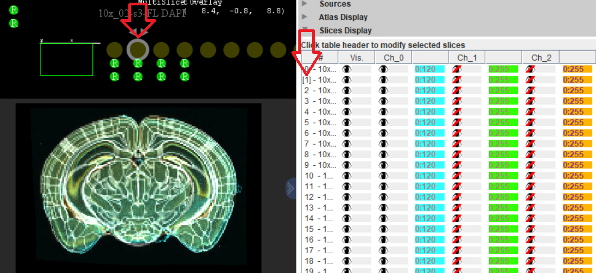

--- 

##### Correcting atlas slicing orientation

A card named `Atlas Slicing` contains two sliders which allow to tune the atlas slicing angles:

You can use slices with recognizable features to orient the atlas slicing. The atlas slicing angles will identical for all sections. It is possible to tilt the atlas, but not to "bend" it.

## Slices registration 

Once the slices have been correctly oriented and positioned along the slicing axis, they can be registered to the atlas in 2D, linearly or in a non linear way.

For automated registration, ABBA uses [elastix](https://github.com/SuperElastix/elastix) with pre-defined registration parameters and takes advantage of its knowledge of the sections calibration as well as on the atlas physical voxel size in order to have an almost parameter free registration.
The metric used to measure the 'distance' between fixed and moving image is the [Mattes mutual information metric](https://doi.org/10.1109/TMI.2003.809072), which should allow for reasonable results when registering different imaging modalities.

---

:warning: If your image file format does not contain multiple resolution levels (level of details (LOD), pyramids, multiresolution), ABBA will not downsample cleanly the image and this could result in bad registration results. You can click `show registration results as ImagePlus` in order to visualize how the slice and the atlas are downsampled for registration.

---

For manual registration, ABBA calls Fiji's [BigWarp](https://imagej.github.io/plugins/bigwarp) plugin.

When a registration 'job' is started for a slice, an indicator of the registration state is added below the slice handle. Its shape is round for an automated registration, and rectangular for a manual registration. This indicator is initially red when the job is not started, orange when it is being processed, and green when the registration is done.

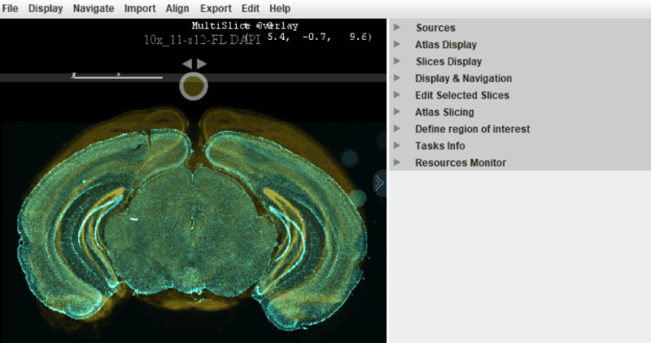

You can start the registrations for all slices in parallel. Depending on your computer, between 4 and 32 registrations will be started in parallel (check the `Resources monitor` card to see how your CPU is busy). You can continue browsing ABBA during the registrations, which are processed asynchronously. As soon as any registration is done, its result is displayed in ABBA.

Below: registration of 80 sections, with, for each slice the following registration sequence:
1. auto affine registration DAPI vs Nissl
2. auto spline registration (16 points DAPI vs NISSL)
3. auto spline registration (16 points autofluorescence vs autofluorescence)

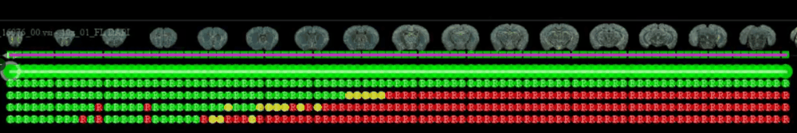

(real time ~ 10 min)

It is possible (and advised) to perform several successive registration. You will usually start by an affine registration followed by one or several spline registrations. For 'difficult slices' where the automated registration result are bad, you can either start by a manual registration to facilitate a following automated registration, or, alternatively, you can directly edit the result of a spline transform, in order to improve it and even to add landmarks in regions in which you are more interested. 

---

:warning: If once or several slices are broken into pieces, achieving a good result over the whole slice could be really difficult or impossible. ABBA does not deal well with discontinuous deformations.

---

### Affine registration (Automated)

You can select the slices you want to register and start an affine registration by clicking, in the top menu bar: 
`Align > Elastix Registration (Affine)`, if you managed to install Elastix, or `Align > Elastix Registration (Affine) on Server`, if elastix is not locally installed.

You will need to select a single channel for both the atlas and the sections for this affine registration. Multichannel registration is not supported for automated registrations.

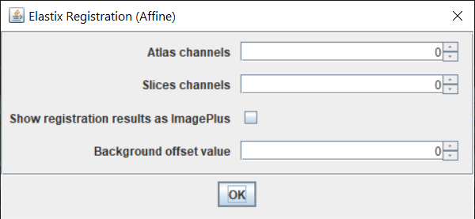

In a lot of cases, an affine registration on the DAPI channel of your sections vs the atlas Nissl atlas channel (0) is a good choice for a first registration.

A few extra options are available:
* `Show registration results as ImagePlus`, if checked, will display the raw data used for elastix registration
* `Background offset value` can be left at zero in most cases. If your camera has a significant zero offset value in comparison to the channel intensities, this offset can be specified here for a better registration.

### Spline registration (Automated)

You can select the slices you want to register and start a spline registration by clicking, in the top menu bar:
`Align > Elastix Registration (Spline)`, if you managed to install Elastix, or `Align > Elastix Registration (Spline) on Server`, if elastix is not locally installed.

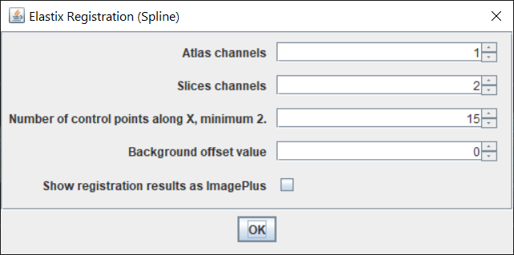

In spline registration, a grid of size "`Number of control points along X`" is used to perform a spline registration between selected slice and the atlas. Again only a single channel registration is supported. 
It is advised to use a value for control point between 5 (25 max total number of landmarks) to 20 (400 max total number of landmarks). 

### BigWarp registration (Manual)

[BigWarp](https://imagej.github.io/plugins/bigwarp) can be used if you want to have a full control over the registration. This method allows to place your own landmarks manually. Since this method is manual, each slice is processed by the user one at a time.

### Editing a registration

When the last registration of a slice is either a BigWarp registration or a spline registration, the result can be manually edited by selected the slice and then clicking in the top menu bar `Align > Edit Last Registration`.

---

:warning: if you select a lot of slices before clicking Edit Last Registration, each editing will be launched successively. If this is what you want, great! Otherwise, take care.

---

This editing will launch BigWarp interface in both cases, but with landmarks from the previous registration already put in place. Using BigWarp's standard commands, which are summarized below, you can move these landmarks or even add new ones. Click the window when you're done editing the transformation, and the new result should appear in ABBA window (take care, the editing cannot be canceled!).

BigWarp commands summary:
* `space` = toggle for landmark mode
* `ctrl + left click` = pin a new landmark on both the fixed (atlas) and the moving (section) image.
* `drag + left click` = in landmark mode, drag an existing landmark
* `f` = display fused transform and fixed image (toggle)
* `t` = transform the image or not (toggle)

You can check [BigWarp documentation](https://imagej.net/plugins/bigwarp) for more information about its interface.

After editing a registration, you can export it again (to QuPath for instance), and reload it.

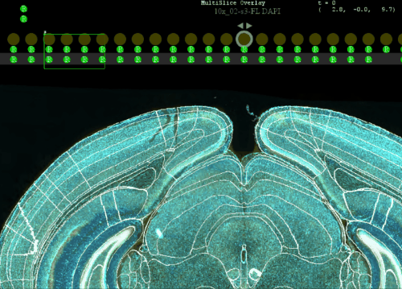

### Canceling / removing a registration

If you are not happy with the result of a registration, you can select the slices where you want to remove the last registration, and:
* click, top menu bar : `Align > Remove Last registration`
* or right- click in ABBA's viewer : `Remove Last registration`

This removal can be cancelled, which is also a way to investigate the quality of the last registration.

### Development - adding a registration method of your own

The registration methods (BigWarp, Elastix spline, affine...) are plugins automatically discovered by ABBA. While the documentation is lacking for the moment, it is possible to make a registration plugin of your own and use it in ABBA.

### Registration workflow example

A typical registration may been obtained using the following successive steps, performed on all slices:

* affine registration on DAPI vs Atlas Nissl (Ch 0)
* spline registration on an Autofluorescent channel vs Atlas Autofluorescent (Ch 1) (15 control points)
* spline registration on DAPI vs Atlas Nissl (Ch 0) (15 control points)

This takes about 10 minutes for 50 slices on a laptop.

## Saving / opening registrations results

At each step of the workflow, you can save the current state of your work (as long as no job is being processed).

To save your project, you can click, in the top menu bar `File > Save State [Experimental]`, and specify a file with a `.json` extension. One or several extra files will be stored on top of the json file. All files are text files, which are fast to save and rather small (in comparison to the images...). So do not hesitate to save multiple successive files all along your workflow, especially because ABBA is experimental and has bugs... Also, do not count on backward compatibility. Consider your work done when you have obtained regions in QuPath, but the ABBA state file has no guarantee currently on the long term.

To open a project where you left it, it is advised to restart Fiji and ABBA, and then click, in the top menu bar `File > Load State [Experimental]`, and select your previously saved `.json` file.

---

:warning: If you move your image files, ABBA won't be able to find your images because absolute file path are used. If you opened images from a QuPath project, fix URIs in QuPath first before reopening ABBA.

---

[**Back to step by step tutorial**](usage.md)
