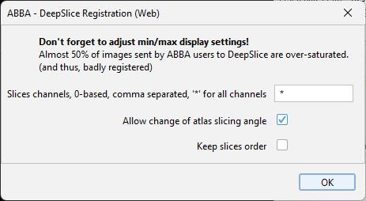
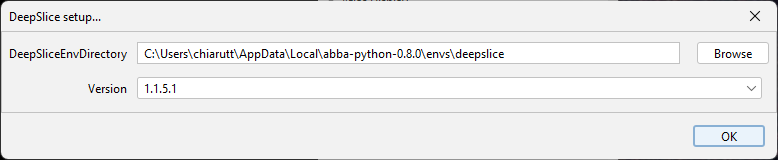
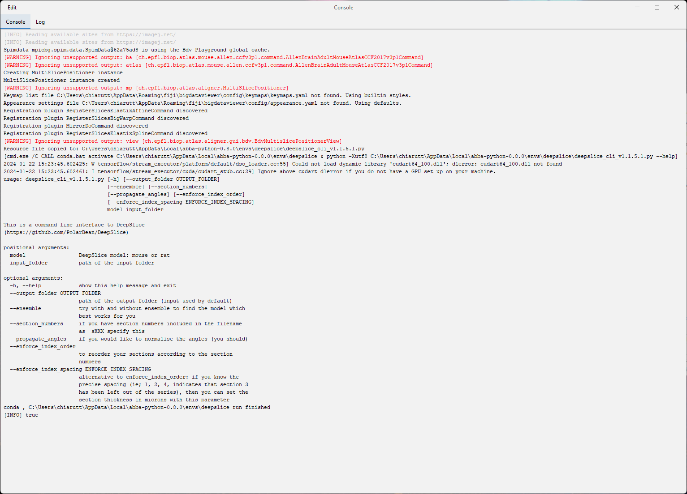

# Using DeepSlice in ABBA

-----
[**Back to registration workflow**](usage.md)

-----

<!-- TOC -->
* [Using DeepSlice in ABBA](#using-deepslice-in-abba)
    * [Using DeepSlice web interface in ABBA](#using-deepslice-web-interface-in-abba)
    * [Using DeepSlice local installation in ABBA](#using-deepslice-local-installation-in-abba)
<!-- TOC -->

-----

[DeepSlice](https://www.deepslice.com.au/guide) is a deep learning based tool for automatic alignment of whole mouse or rat brain histological sections. It is developed in the McMullan lab group by [Harry Carey](https://github.com/polarbean/) at [Macquarie University](https://www.mq.edu.au/), Sydney, Australia. It was designed to work primarily with [QuickNII](https://www.nitrc.org/projects/quicknii).

A [preprint is available](https://www.biorxiv.org/content/10.1101/2022.04.28.489953v1.full), the tool is [accessible via a web interface](https://www.deepslice.com.au/) or [via PyPI](https://pypi.org/project/DeepSlice/), and [its source code is on github](https://github.com/PolarBean/DeepSlice).

It can work with the Allen mouse brain atlas and the Rat Waxholm atlas, in coronal orientation.

Using DeepSlice within ABBA thus gives very fast results and automates many initial steps of the alignment:

* atlas cutting angle estimation
* initial positioning of slices along the axis
* in-plane affine registration (DeepSlice does not deform beyond affine transformation)

After DeepSlice, ABBA can be used to further refine the alignment, for instance by applying an in-plane non-linear step with BigWarp or Elastix.

---

:warning: make sure that all the slices belong to the same animal

---

---

:warning: Set the slices display settings to avoid oversaturated pixels!

---

DeepSlice works with 8-bits RGB images. ABBA always rescales intensities according to the user display settings. Please make sure that the display settings are not completely off, resulting in an oversaturated image, or in an almost fully black image. When more features are visible, the registration quality will improve.

### Using DeepSlice web interface in ABBA

* set the slices display settings to avoid oversaturated pixels
* select all the slices you want to register
* click in the top menu bar: `Align > ABBA - DeepSlice Registration (web)`

You get the following window:

* `Slices channels, 0-based, comma separated, '*' for all channels` - used to select the channels you want to export to DeepSlice. You can for instance export a nuclear channel only. You can export the first and third channel by writing `0,2`. Usually, a RGB image contains only one channel.
* `Allow change of atlas slicing angle` - When checked, ABBA will adapt the atlas slicing angle based on the median slicing angles given by DeepSlice. If you don't want to modify the atlas slicing angle, you can uncheck this box.
* `Average of several models (slower)` - this parameter is ignored in the web interface.
* `Post_processing` - this parameter is ignored in the web interface
* `Spacing (micrometer), used only when 'Keep order + set spacing' is selected` - this parameter is ignored in the web interface.

After pressing ok, you get this window:

After clicking it, a web page will open in your browser with the DeepSlice interface:

You can drag and drop the content of your dataset folder into this page, and then submit the task.

---

:warning: Checking `Slower but more accurate results` is advised because DeepSlice is very fast anyway. If your slices are regularly evenly spaced, you can click `Use section numbers`. Check `Normalise section angles` because ABBA forces this normalization anyway afterwards (only one cutting angle allowed).

---

When the registration is done, you can download the result json file.

Put back the json file in the result folder.

Then click ok in the small DeepSlice result window. You will see, if you selected the option, a window stating that slicing angles have been adjusted. After pressing ok again, the slices will be moved and transformed to their new position.

**Before**

**After**

You can adjust then, review, regularly space the slices position and perform non linear registrations with the rest of ABBA functionalities.

### Using DeepSlice local installation in ABBA

If you managed to install a Conda env containing [DeepSlice locally as explained in this readme](https://github.com/BIOP/ijl-utilities-wrappers), you can run DeepSlice directly in ABBA and fully automate the registration process.

You can check whether DeepSlice is functional by running `DeepSlice > DeepSlice setup...`:

and select the proper folder containing the conda environment for DeepSlice (if you used the ABBA installer for windows, do not touch it, it should already set correctly).

After clicking OK, your console window should display the ouput of the help command of the command line interface of DeepSlice:

Then, to run DeepSlice locally, select the slices you want to register and run `Align > ABBA - DeepSlice registration (local)`. This window will pop-up:

* `Slices channels, 0-based, comma separated, '*' for all channels` - used to select the channels you want to export to DeepSlice. You can for instance export a nuclear channel only. You can export the first and third channel by writing `0,2`. Usually, a RGB image contains only one channel.
* `Allow change of atlas slicing angle` - When checked, ABBA will adapt the atlas slicing angle based on the median slicing angles given by DeepSlice. If you don't want to modify the atlas slicing angle, you can uncheck this box.
* `Average of several models (slower)` - run DeepSlice two times with different models in order to improve the registration results.
* `Post_processing` - this parameter can be set as:
  * `Keep order`: maintain the current order of the sections
  * `Keep order + ensure regular spacing`: maintain the current order of the sections and separate them by a constant value, which is guessed by DeepSlice
  * `Keep order + set spacing (parameter below)`: maintain the current order of the sections and separate them by a constant value, which is set by you, according to the parameter below:
* `Spacing (micrometer), used only when 'Keep order + set spacing' is selected` - the output spacing between selected sections if `Keep order + set spacing (parameter below)` is selected

-----
[**Back to registration workflow**](usage.md)

-----
