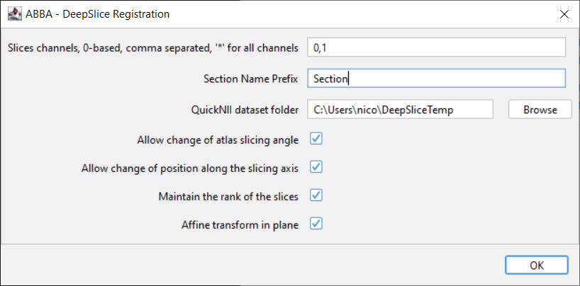
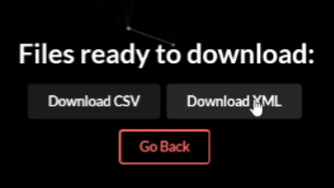
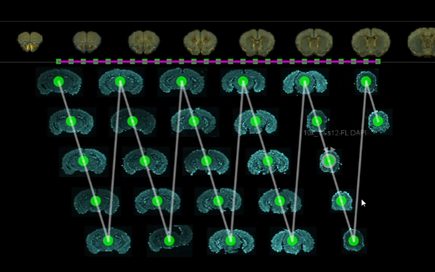
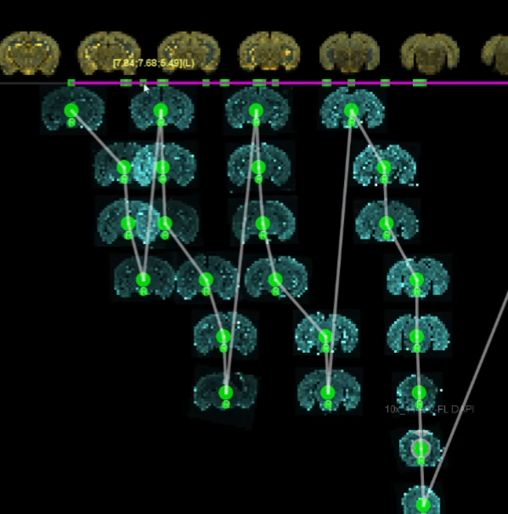

# Using DeepSlice in ABBA

[DeepSlice](https://www.deepslice.com.au/guide) is a deep learning based tool for automatic alignment of whole mouse brain histological sections. It is developed in the McMullan lab group by [Harry Carey](https://github.com/polarbean/) at [Macquarie University](https://www.mq.edu.au/), Sydney, Australia. It was designed to work primarily with [QuickNII](https://www.nitrc.org/projects/quicknii).

A [preprint is available](https://www.biorxiv.org/content/10.1101/2022.04.28.489953v1.full), the tool is [directly accessible via a web interface](https://www.deepslice.com.au/), and [its source code is on github](https://github.com/PolarBean/DeepSlice).

It is currently limited to registrations with the Allen mouse brain atlas and coronal sections. 

---
ABBA can facilitate the use of DeepSlice by generating low resolution sections and by reading back the QuickNII result XML file. Using DeepSlice within ABBA thus gives very fast results and automates many initial steps of the alignement:

* atlas cutting angle estimation
* initial positioning of slices along the axis
* in-plane affine registration (DeepSlice does not deform beyond affine transformation)

After DeepSlice, ABBA can be used to further refine the alignement, for instance by applying an in-plane non-linear step with BigWarp or Elastix.

---

:warning: make sure that all the slices belong to the same animal

---

## Using DeepSlice in ABBA: step by step procedure
* select all the slices you want to register
* click in the top menu bar: `Align > DeepSlice Registration`

You get the following window:

* `Slices channels, 0-based` - used to select the channels you want to export to DeepSlice. You can for instance export a nuclear channel only. You can export the first and third channel by writing `0,2`.
* `Section Name Prefix` - prefix of the image name when exported
* `QuickNII dataset folder` - choose an empty folder: exported sections will be put in this empty folder. At the end of the procedure, you will need to put back in this folder the resulting xml file given by DeepSlice web interface (it has to be named **exactly** `results.xml`)
* `Allow change of atlas slicing angle` - When checked, ABBA will adapt the atlas slicing angle based on the median slicing angles given by DeepSlice. If you don't want to modify the atlas slicing angle, you can uncheck this box.
* `Allow change of position along the slicing axis` - you probably want to let this box checked. If not, the slices will stay at their location along the axis.
* `Maintain the rank of the slices` - if you allow to change the position of slices along the axis (checkbox above), it may occur that deepslice swap some slices position (Slices 1-2-3-4-5 might be reordered  1-2-4-3-5 for instance). If you are sure of your slice order, you may want to avoid such change and let this box checked.
* `Affine transform in plane` - allow to transform the slices in plane. There may be rare cases where you want to avoid it, but I don't know which ones, so let it checked.

After pressing ok, you get this window:

After clicking it, a web page will open in your browser with the DeepSlice interface:

You can drag and drop the content of your dataset folder into this page, and then submit the task.

---

:warning: Checking `Slower but more accurate results` is advised because DeepSlice is very fast anyway. If your slices are regularly evenly spaced, you can click `Use section numbers`. Check `Normalise section angles` because ABBA forces this normalization anyway afterwards (only one cutting angle allowed).

---

When the registration is done, you can download the result xml file:

Put back the xml file in the result folder (and name it `results.xml` if that's not the case).

Then click ok in the small DeepSlice result window. You will see, if you selected the option, a window stating that slicing angles have been adjusted. After pressing ok again, the slices will be moved and transformed to their new position.

**Before**

**After**

You can adjust then, review, regularly space the slices position and perform non linear registrations with the rest of ABBA functionalities.

[**Back to step by step tutorial**](usage.md)