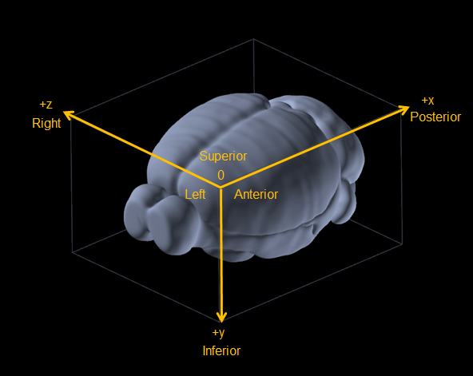

## Using ABBA

---

:warning: ABBA is still in an experimental phase. **Expect (and report) bugs** and **do not expect backward compatibility** when a more stable version will be released (all the code is versioned and stored in a worst case scenario).

---

### Recommended workflow
It is highly recommended to use [QuPath](https://qupath.github.io/) in order to define the dataset of brain slices. It is possible to use only Fiji, but the analysis capabilities are then limited (no support of multiresolution files in vanilla ImageJ). This documentation will only detail the recommended workflow that uses QuPath and Fiji's ABBA plugin.
 
For each animal:
* [**Define sections dataset**](create_dataset_and_open.md)
  * [Define the serial sections dataset into a QuPath project](create_dataset_and_open.md)
  * [Open these sections by importing this QuPath project into Fiji's ABBA plugin](create_dataset_and_open.md#import-a-qupath-project-in-abba)
* [**Register sections to the Allen Brain Atlas**](registration.md)
  * [Basic slices manipulation and display](registration.md)
  * [Slices positioning along the atlas axis](registration.md#first-coarse-positioning)
  * [Correcting the atlas cutting angle](registration.md#correcting-atlas-slicing-orientation)
  * [In-plane (2D) slices registration (manual, automated affine, automated spline)](registration.md#slices-registration)
  * [Saving / opening an ABBA project](registration.md#saving--opening-registrations-results)
* [**Register sections to the Allen Brain Atlas using DeepSlice**](registration_with_deepslice.md)
* [**Reuse ABBA's registration results in QuPath**](qupath_analysis.md)
  * [Export ABBA's registration results to the QuPath project](qupath_analysis.md)
  * [Import registration results as QuPath annotations](qupath_analysis.md#importing-abba-registration-results-in-qupath)
  * [(Optional) Correct the registration for some slices in ABBA and re-export the new result to QuPath](registration.md#editing-a-registration)
  * [Detect cells in QuPath](qupath_analysis.md#analysis-in-qupath)
  * [Append CCF coordinates in QuPath detected cells measurements](qupath_analysis.md#export-result-into-common-coordinates-of-the-allen-brain-atlas-ccfv3)
  * [Export a table containing, for all cells, their measurements as well as their location in the brain atlas CCF](qupath_analysis.md#display-results)
* [**Other export modalities (warped slices, etc.)**](export.md)
* **In your prefered data analysis software, combine and/or display these results for all animals**

You can click on each of the steps above to follow a typical workflow. The user interface is explained progressively through these steps. For convenience, here are links for the various controls which are covered:
* [Atlas display](create_dataset_and_open.md#allen-brain-atlas-display-options)
* [Atlas slicing (rotations)](registration.md#correcting-atlas-slicing-orientation)
* [Slices selection](registration.md#slices-selection)
* [Slices display](registration.md#slices-display-options)
* [Moving slices along the atlas](registration.md)
* [Adjusting slices before registration (flip / rotate)](registration.md#rotate--flip-slices)
* [Affine registration](registration.md#affine-registration-automated)
* [Spline registration](registration.md#spline-registration-automated)
* [Registration with BigWarp](registration.md#bigwarp-registration-manual)
* [Editing a registration](registration.md#editing-a-registration)

In order to be fast, ABBA's workflow is designed to avoid time-expensive computations. To achieve this, the transformed slices are never fully computed. At the end of the workflow, it is the regions of the atlas which are transformed into the original slices coordinates. This has the extra advantage of avoiding any interpolation of the original data for its analysis. Nonetheless, it can be useful to compute the transformed imaged into the atlas coordinates for display purpose. ABBA thus provides a way to export the transformed images into the atlas coordinates:
* [Export transformed registered images](registration.md#exporting-slices-region-as-imagej-stack)

### Allen Brain CCFv3

The common coordinates framework is like this [(source)](http://help.brain-map.org/download/attachments/5308472/3DOrientation.png?version=1&modificationDate=1368132564812&api=v2):



Mind the axes names and orientations!

### Troubleshooting
If you have an issue with ABBA:
* Look if the answer is not in the documentation.
* You can ask for help in the [image.sc forum](forum.image.sc/) (add `abba` and `fiji` or `qupath` tags)
* You can [open an issue in GitHub](https://github.com/BIOP/ijp-imagetoatlas/issues)

If you managed to install ABBA, these 3 options are better done directly from the plugin (top menu bar `Help > Go to documentation` and `Help > Ask for help in the forum`). Asking for help from ABBA allows to pre-fill a form with some hardware and software information. There is also a user feedback from if you want to give your opinion about what should be improved or supported.

## Supported file formats
```
TL; DR: Use calibrated VSI, CZI, OME-TIFF, NDPI, 
a few others (please read the text below), 
or convert to OME-TIFF.
```

All files need to be properly calibrated (microns, millimeters, etc, but not pixels!). ABBA takes advantage of the  calibration to set appropriate registration parameters. 

---

 :bulb: It is strongly recommended to work with multiresolution file formats (VSI, OME-TIFF, SVS), since brain slices are usually very big 2d images. ABBA, like QuPath, uses pre-computed downsampled images of these files to speed-up (very significantly) the display and processing of these images. Downsampled images also help for registration, since the registration is made with large scale features (size above  a few cells), which are incorrectly sampled if no downsampled image pre-exists.

---

---

:warning: Because Fiji is used is the workflow, only Bio-Formats supported formats are correctly handled. You can check on  [the Bio-Formats documentation](https://docs.openmicroscopy.org/bio-formats/6.6.1/supported-formats.html) if your file formats will be correctly handled. This will be the case if `Pyramid` is checked. File which can be opened **only** via [`OpenSlide`](https://openslide.org/) are not supported.

Tested file formats for ABBA :

* CZI (Zeiss, ++, you may have to tick `Split RGB channels` for 16-bits RGB images)
* VSI (Olympus, +++)
* LIF (Leica, +, no multiresolution support in bio-formats)

CZI, NDPI, OME-TIFF should work perfectly. Let us know if that's the case in practice and we'll update the list.

RGB images as well as 8-bits and 16-bits images have also been successfully tested.

---

If your image can't be loaded in using `Bio-Formats`, you can convert your slides in `ome.tiff` format. Several options are available, for instance by using [bfconvert with Kheops](https://c4science.ch/w/bioimaging_and_optics_platform_biop/image-processing/imagej_tools/ijp-kheops/), or [bioformatsf2raw](https://c4science.ch/w/bioimaging_and_optics_platform_biop/image-processing/qupath/ome-tiff-conversion/) for a fast conversion.